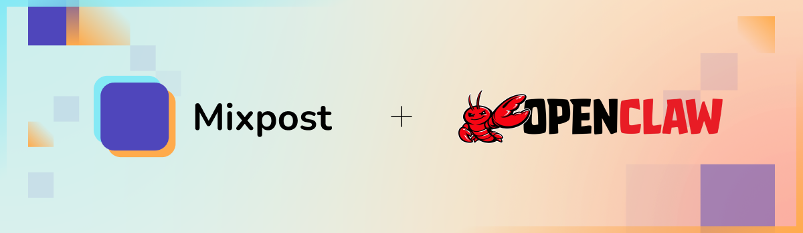

# Mixpost Skill for OpenClaw

[](https://mixpost.app)

* * *

An [OpenClaw](https://openclaw.ai) skill for managing social media content through [Mixpost](https://mixpost.app) - a self-hosted social media management software.

Automate your social media workflow with AI. Create, schedule, and publish posts across multiple platforms using natural language commands. Let your AI assistant handle the heavy lifting while you focus on growing your business.

## Supported Platforms

- Facebook
- Twitter/X
- Instagram
- LinkedIn
- Pinterest
- TikTok
- YouTube
- Mastodon
- Google Business Profile
- Threads
- Bluesky

## Installation

Copy `SKILL.md` to your OpenClaw skills directory.

## Configuration

Set the following environment variables:

```bash
export MIXPOST_URL="https://your-mixpost-instance.com/mixpost"
export MIXPOST_ACCESS_TOKEN="your-access-token"
export MIXPOST_WORKSPACE_UUID="your-workspace-uuid"
```

### Getting Your Credentials

1. **Access Token**: Navigate to your Mixpost dashboard → User menu → **Access Tokens** → **Create**
2. **Workspace UUID**: Go to **Social Accounts** page → Click the **3 dots menu** on any account → Copy the workspace UUID

## Features

- Manage social accounts
- Upload and manage media files
- Create, schedule, and publish posts
- Manage tags
- Platform-specific post options

## Documentation

See [SKILL.md](SKILL.md) for full API documentation and usage examples.

## License

MIT
